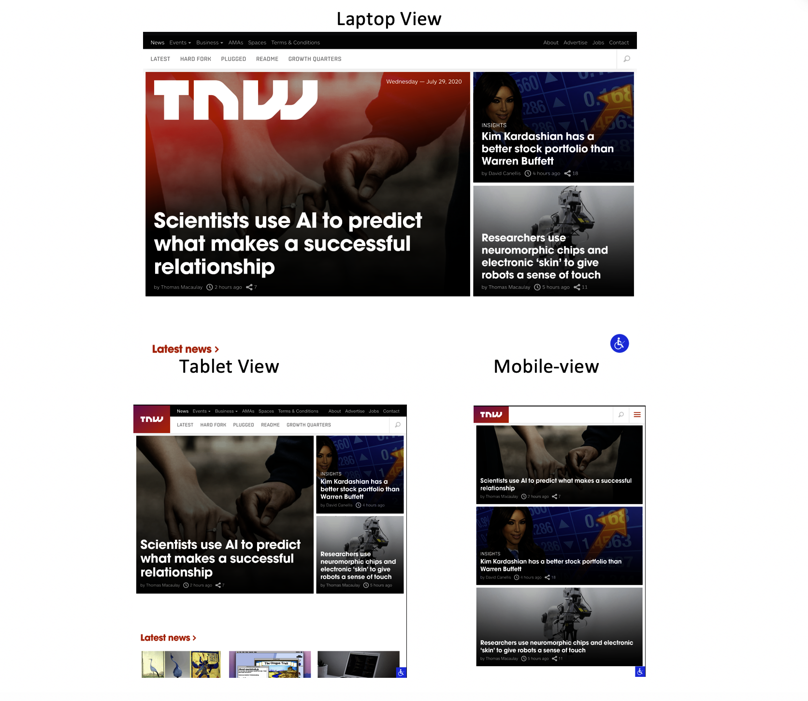

# TNW-Responsive-design

> The objective of this project was to create a fully responsive clone of [The Next Web Page](https://www.thenextweb.com/)

The project was the sixth on the microverse HTML/CSS curriculum created using CSS positioning, FLEX, Float and Grid for some elements.

## Built With

- HTML, CSS.
- No frameworks,
- Flex, Grid, Transform and Float

## Live Demo

[Live Demo Link](https://raw.githack.com/ABDELLANI-Youcef/TNW-Responsive-design/homepage-responsive/index.html)

## Authors

👤 **Paul Balitema Kabali**

- Github: [@pbkabali](https://github.com/pbkabali)
- Twitter: [@pbkabali](https://twitter.com/pbkabali)
- Linkedin: [linkedin](https://linkedin.com/in/engineerbpk)

👤 **Youcef ABDELLANI**

- Github: [@ABDELLANI-Youcef](https://github.com/ABDELLANI-Youcef)
- Twitter: [@YoucefAbdellani](https://twitter.com/YoucefAbdellani)
- Linkedin: [linkedin](https://www.linkedin.com/in/youcef-abdellani-b79361124/)

## 🤝 Contributing

Contributions, issues and feature requests are welcome!

Feel free to check the [issues page](https://github.com/ABDELLANI-Youcef/TNW-Responsive-design/issues).

## Show your support

Give a ⭐️ if you like this project!

## Acknowledgments

- Web Archive
- CSS Tricks page
- Microverse Team 140-The Cupids
- Microverse Team 137-The Vulcans
- W3 Schools
- Odin Project

## 📝 License

This project is [MIT](lic.url) licensed.